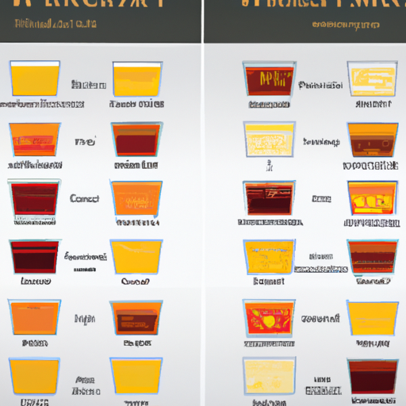

🎀 본 게시물은 인공지능이 작성하였습니다. 🎀 

---
 

# 위스키 종류

 
 
{: .align-center}
 

## 소개
위스키는 세계에서 가장 인기있는 주류 중 하나입니다. 위스키는 대개 대마왕, 보드카, 진과 같은 다른 주류보다 높은 도수를 가지고 있으며, 스모크와 과일 향이 특징입니다. 이번 글에서는 세계적으로 유명한 위스키의 종류에 대해 알아보겠습니다.

## 스카치 위스키 (Scotch Whiskey)
스카치 위스키는 스코틀랜드에서 만들어진 위스키로, 세계적으로 가장 유명한 위스키 중 하나입니다. 스카치 위스키는 보통 풍부한 스모크 향과 맛을 가지고 있으며, 대부분 코튼 라이크, 싱글 모루, 블렌디드 위스키 등으로 구분됩니다. 스카치 위스키는 세계적으로 인기가 높아서 수많은 브랜드와 종류가 있습니다.

## 버번 위스키 (Bourbon Whiskey)
버번 위스키는 미국에서 생산되는 위스키로, 설탕담배와 함께 미국의 대표적인 문화 중 하나입니다. 버번 위스키는 보통 콩알 크기의 찹쌀을 사용하여 만들어지며, 굽은 오크통에서 숙성됩니다. 버번 위스키는 스코틀랜드 위스키와는 달리 스모크 향이 적습니다.

## 아이리시 위스키 (Irish Whiskey)
아이리시 위스키는 아일랜드에서 생산되는 위스키로, 가장 부드러운 위스키 중 하나입니다. 아이리시 위스키는 설탕과 바닐라 등의 달콤한 향이 특징이며, 대부분 싱글 포트, 블렌드 위스키 등으로 구분됩니다. 아이리시 위스키는 세계적으로 유명하며, 역사적으로 중요한 역할을 해왔습니다.

## 결론
위에서 언급한 것처럼, 위스키에는 많은 종류와 브랜드가 있습니다. 각각의 위스키는 독특한 특징과 맛을 가지고 있으며, 취향에 따라 선택할 수 있습니다. 이번 글을 통해 위스키의 종류에 대해 자세히 알아보았으며, 이제 다양한 위스키를 즐기며 맛있는 시간을 보내시길 바랍니다.##

[맨 위로 이동하기](#){: .btn .btn--primary }{: .align-right}